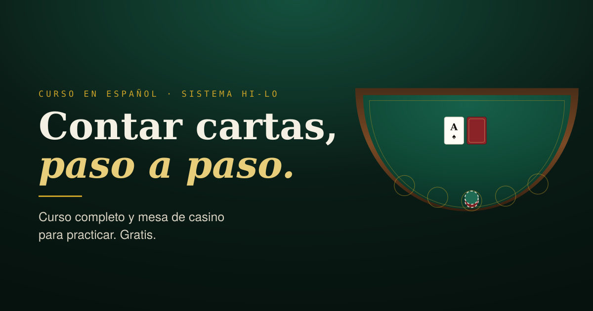

# Casa & Zapato

Curso gratuito en español para aprender a **contar cartas en blackjack** con el sistema Hi-Lo, explicado paso a paso, con una mesa de casino simulada para practicar.

🔗 **[cstr07.github.io/conteo-cartas](https://cstr07.github.io/conteo-cartas/)**



---

## Qué incluye

**Curso de 13 módulos** que va de cero a mesa: por qué el conteo funciona, estrategia básica completa con tablas, los valores Hi-Lo, conteo corrido, conteo real, tamaño de apuesta y capital, las 22 desviaciones de índice, cómo elegir mesa, cómo no ser detectado, plan de 8 semanas y glosario.

**Cuatro entrenadores interactivos:**

| Entrenador | Qué practica |
|---|---|
| Velocidad | Conteo corrido a ritmo configurable, de 0.7 a 5.5 cartas por segundo |
| Conteo real | La división entre mazos restantes y la apuesta que corresponde |
| Mesa de casino | Juego completo de 6 mazos con corrección de cada jugada |
| Desviaciones | Illustrious 18 y Fab 4, con explicación del índice |

## Detalles técnicos

- **Un solo archivo HTML.** Sin build, sin framework, sin dependencias salvo Google Fonts.
- **Sin backend.** Todo corre en el navegador.
- **Sin almacenamiento.** No usa cookies, `localStorage` ni analítica. No se recoge ningún dato.
- **Accesible.** Navegación por teclado, `:focus-visible`, `prefers-reduced-motion` y etiquetas ARIA en el SVG.

### Reglas de la mesa simulada

6 mazos · el crupier se planta con 17 suave (S17) · el blackjack paga 3:2 · doblar con cualquier par de cartas · doblar tras dividir (DAS) · dividir hasta 3 manos · rendición tardía · penetración configurable del 50 % al 83 %.

La carta tapada del crupier **no entra al conteo hasta que se revela**, y si nunca se revela, nunca se cuenta. Los demás jugadores juegan estrategia básica, así que el flujo de cartas coincide con el de una mesa real (unas 2.6 cartas por jugador y ronda).

### Verificación

El motor está probado con jsdom. Resultados de la última corrida:

| Prueba | Resultado |
|---|---|
| Estrategia básica contra 53 casos canónicos | 53 / 53 |
| Valores Hi-Lo de los 13 rangos | 13 / 13 |
| Suma de un mazo completo | 0 (sistema balanceado) |
| Crupier terminando por debajo de 17 | 0 casos |
| Pago del blackjack | exactamente 3:2 |
| Ventaja de la casa, 60,000 manos con juego perfecto | −0.59 % ± 0.47 % (teórico −0.43 %) |
| Manos con mesa llena y penetración máxima | 0 errores de ejecución |

---

## Cómo publicarlo

### Opción A — desde una rama (la más simple)

```bash
# 1. Crea el repositorio en GitHub con el nombre: conteo-cartas
# 2. Desde la carpeta de este proyecto:
git init
git add .
git commit -m "Curso de conteo de cartas en blackjack"
git branch -M main
git remote add origin https://github.com/CSTR07/conteo-cartas.git
git push -u origin main
```

Luego en GitHub: **Settings → Pages → Source: `Deploy from a branch` → Branch: `main` / `(root)` → Save**.

En uno o dos minutos queda publicado.

### Opción B — con GitHub Actions

Este repositorio ya trae el workflow en `.github/workflows/deploy.yml`. Si prefieres esta vía, haz el mismo `git push` de arriba y luego ve a **Settings → Pages → Source: `GitHub Actions`**.

A partir de ahí cada `git push` a `main` republica el sitio solo.

> Usa **una** de las dos opciones, no las dos. Si eliges la A, puedes borrar la carpeta `.github`.

### Si le pones otro nombre al repositorio

Hay que actualizar la URL en dos lugares:

1. `index.html` — las etiquetas `canonical`, `og:url` y las dos de `og:image` / `twitter:image`
2. `sitemap.xml` y `robots.txt`

Con un solo comando:

```bash
grep -rl 'conteo-cartas' . --exclude-dir=.git | xargs sed -i 's|conteo-cartas|TU-NOMBRE|g'
```

En macOS usa `sed -i ''` en lugar de `sed -i`.

> `404.html` no hace falta tocarlo: calcula el enlace de vuelta al inicio por su cuenta.

### Probarlo antes de publicar

```bash
python3 -m http.server 8000
# abre http://localhost:8000
```

Abrir `index.html` con doble clic también funciona, porque no hay dependencias entre archivos.

---

## Archivos

```
├── index.html                  el sitio completo (curso + entrenadores)
├── 404.html                    página de error
├── favicon.svg                 ícono de la pestaña
├── og-image.png                vista previa al compartir el enlace (1200×630)
├── robots.txt                  indexación
├── sitemap.xml                 mapa del sitio
├── .nojekyll                   evita que GitHub Pages procese el sitio con Jekyll
├── LICENSE                     licencia MIT
└── .github/workflows/deploy.yml   publicación automática (opcional)
```

---

## Aviso

Material educativo sobre la matemática del blackjack. **Solo para mayores de edad.**

Contar cartas no es ilegal en México ni en Estados Unidos, pero los casinos son propiedad privada y pueden negarte el juego. Ninguna estrategia garantiza ganancias: la ventaja del conteo ronda el 1 % y la varianza a corto plazo es enorme.

Si el juego está afectando tu vida o la de alguien cercano, en México puedes contactar a [Jugadores Anónimos](https://jugadoresanonimos.org.mx) o a la Línea de la Vida, **800 911 2000**.

## Créditos

Sistema Hi-Lo según el trabajo de Edward O. Thorp y Harvey Dubner. Desviaciones de índice (Illustrious 18 y Fab 4) según Don Schlesinger, *Blackjack Attack*.

Tipografías: Bodoni Moda, Inter y JetBrains Mono, vía Google Fonts.

## Licencia

MIT — ver [LICENSE](LICENSE).
